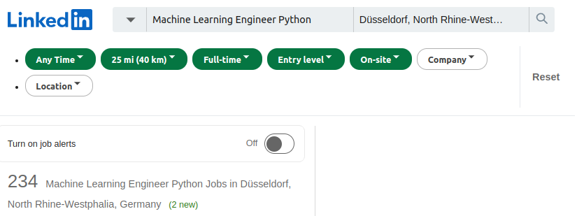
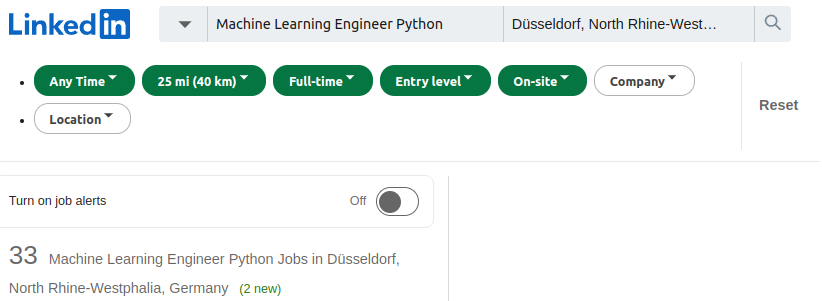

# What does this do?
### This Notebook let's you filter your Linkedin job queries even further
- Don't want consultant jobs?
- Want to put your masters degree to good use and look for jobs that require one exclusively?
- Want to use advanced filters like document embeddings paired with a neural net?

**&#8594; Define custom filters and display only matching jobs to reduce your time looking through job entries.**
## Before:

## After:


# Notebook:

```python
import requests
from IPython.display import HTML, IFrame
from bs4 import BeautifulSoup
import re
import random
import os
import time
import pandas as pd
import logging
from linkedin_api import Linkedin
import configparser
import json
```


```python
level = logging.DEBUG
logging.basicConfig(filename='example.log', filemode='w', encoding='utf-8', level=level)
```

### Define necessary api requests


```python
cfg = configparser.ConfigParser()
cfg.read('credentials.ini')
api = Linkedin(cfg['credentials']['username'], cfg['credentials']['password'], authenticate=True) #only for company details
```


```python
session = requests.session()
```


```python
_last_request_time = 0
def cached_exception_request(req_fn, cache_file_path, redownload=False, cache=True, retries=3, **kwargs):
    global _last_request_time
    logging.info(f'Checking cache for {cache_file_path}')
    res_text = None
    if redownload or not os.path.exists(cache_file_path):
        logging.info(f'Requesting new {req_fn}')
        success = False
        tries = 0
        while not success and tries < retries:
            time_between_requests = 0.9+random.random()*2.1
            logging.info("Sending request...")
            try:
                current_time = time.time()
                if current_time - _last_request_time < time_between_requests:
                    logging.info(f"Sleeping {time_between_requests - (current_time - _last_request_time)} seconds before request")
                    time.sleep(time_between_requests - (current_time - _last_request_time))
                _last_request_time = time.time()
                res = req_fn(**kwargs)
                logging.info(f"Received code: {res.status_code}")
                if res.status_code == 200 or res.status_code == 302:
                    logging.info("success")
                    success = True
                    res_text = res.text
                    if cache:
                        logging.info(f"saving to file {cache_file_path}")                        
                        with open(cache_file_path, 'w') as cf:
                            cf.write(res_text)
                elif str(res.status_code).startswith('4'):
                    logging.error("Request failed. Trying again.")
                elif str(res.status_code).startswith('5'):
                    logging.error("Request failed. Trying again.")
                elif res.status_code == 999:
                    logging.error('Request is faulty? (missing cookies etc?)')
                    print('Try logging in for this')
                    break
            except requests.exceptions.RequestException as e:
                logging.error("Python requests error:", e)            
            tries += 1

    else:
        logging.info(f'Loading cached entry {req_fn}')
        with open(cache_file_path, 'r') as cf:
            res_text = cf.read()
    return res_text

def cached_exception_api_request(req_fn, cache_file_path, redownload=False, cache=True, retries=3, **kwargs):
    global _last_request_time
    logging.info(f'Checking cache for {cache_file_path}')
    res_text = None
    if redownload or not os.path.exists(cache_file_path):
        logging.info(f'Requesting new {req_fn}')
        success = False
        tries = 0
        while not success and tries < retries:
            time_between_requests = 0.9+random.random()*2.1
            logging.info("Sending request...")
            try:
                current_time = time.time()
                if current_time - _last_request_time < time_between_requests:
                    logging.info(f"Sleeping {time_between_requests - (current_time - _last_request_time)} seconds before request")
                    time.sleep(time_between_requests - (current_time - _last_request_time))
                _last_request_time = time.time()
                res = req_fn(**kwargs)
                success = True
                res_text = res
                if cache:
                    logging.info(f"saving to file {cache_file_path}")                        
                    with open(cache_file_path, 'w') as cf:
                        json.dump(res_text, cf)
            except (requests.exceptions.RequestException, json.JSONDecodeError, KeyError) as e:
                logging.error("Python requests error:", e)            
            tries += 1

    else:
        logging.info(f'Loading cached entry {req_fn}')
        with open(cache_file_path, 'r') as cf:
            res_text = json.load(cf)
    return res_text

def job_search(keyword_list:list, location:list, geoId:str='', locationId:str='', distance=25, filter_company:list=[], filter_geoId:list=[], filter_jobtype=['F'], filter_joblevel=['2'], pageNum=0, **kwargs):

    headers = {
        'DNT': '1',
        'User-Agent': 'Mozilla/5.0 (X11; Linux x86_64) AppleWebKit/537.36 (KHTML, like Gecko) Chrome/101.0.4951.64 Safari/537.36',
        'sec-ch-ua': '" Not A;Brand";v="99", "Chromium";v="101", "Google Chrome";v="101"',
        'sec-ch-ua-mobile': '?0',
        'sec-ch-ua-platform': '"Linux"',
    }
    base_url = 'https://www.linkedin.com/jobs/search?'
    params = {}
    if keyword_list:
        params['keywords']="+".join(keyword_list)
    if location:
        params['location']="+".join(location)
    params['locationId']=locationId
    params['f_TPR']=''
    if geoId:
        params['geoId']=geoId
    if distance:
        params['distance']=distance
    if filter_company:
        params['f_C']=",".join(filter_company)
    if filter_geoId:
        params['f_PP']=",".join(filter_geoId)
    if filter_jobtype:
        params['f_JT']=",".join(filter_jobtype)
    if filter_joblevel:
        params['f_E']=",".join(filter_joblevel)
    if pageNum:
        params['pageNum']=pageNum
    joined_params = params | kwargs
    param_string = '&'.join([f'{k}={v}' for k,v in joined_params.items()])
    return session.get(base_url + param_string, allow_redirects=False, headers=headers)

def job_search_scroll(keyword_list:list, location:list, geoId:str='', locationId:str='', distance=25, filter_company:list=[], filter_geoId:list=[], filter_jobtype=['F'], filter_joblevel=['2'], pageNum=0, **kwargs):

    headers = {
        'DNT': '1',
        'User-Agent': 'Mozilla/5.0 (X11; Linux x86_64) AppleWebKit/537.36 (KHTML, like Gecko) Chrome/101.0.4951.64 Safari/537.36',
        'sec-ch-ua': '" Not A;Brand";v="99", "Chromium";v="101", "Google Chrome";v="101"',
        'sec-ch-ua-mobile': '?0',
        'sec-ch-ua-platform': '"Linux"',
    }
    base_url = 'https://www.linkedin.com/jobs-guest/jobs/api/seeMoreJobPostings/search?'
    params = {}
    if keyword_list:
        params['keywords']="+".join(keyword_list)
    if location:
        params['location']="+".join(location)
    params['locationId']=locationId
    params['f_TPR']=''
    if geoId:
        params['geoId']=geoId
    if distance:
        params['distance']=distance
    if filter_company:
        params['f_C']=",".join(filter_company)
    if filter_geoId:
        params['f_PP']=",".join(filter_geoId)
    if filter_jobtype:
        params['f_JT']=",".join(filter_jobtype)
    if filter_joblevel:
        params['f_E']=",".join(filter_joblevel)
    if pageNum:
        params['pageNum']=pageNum
    joined_params = params | kwargs
    param_string = '&'.join([f'{k}={v}' for k,v in joined_params.items()])
    return session.get(base_url + param_string, allow_redirects=False, headers=headers)

def job_full_entry(url):
    return requests.get(url)

def job_inner_entry(jobId, refId, trackingId):
    return session.get(f'https://www.linkedin.com/jobs-guest/jobs/api/jobPosting/{jobId}?refId={refId}&trackingId={trackingId}')

def company_request(name):
    return api.get_company(name)
# def company_request(url):
#     cookies = {
#     'lang': 'v=2&lang=en-us' #Fix to english
#     }

#     headers = {
#         'Accept': 'text/html,application/xhtml+xml,application/xml;q=0.9,image/avif,image/webp,image/apng,*/*;q=0.8,application/signed-exchange;v=b3;q=0.9',
#         'Accept-Language': 'de-DE,de;q=0.9',
#         'Cache-Control': 'max-age=0',
#         'Connection': 'keep-alive',
#         'DNT': '1',
#         'Referer': 'https://www.linkedin.com/',
#         'Sec-Fetch-Dest': 'document',
#         'Sec-Fetch-Mode': 'navigate',
#         'Sec-Fetch-Site': 'same-site',
#         'Sec-Fetch-User': '?1',
#         'Upgrade-Insecure-Requests': '1',
#         'User-Agent': 'Mozilla/5.0 (X11; Linux x86_64) AppleWebKit/537.36 (KHTML, like Gecko) Chrome/101.0.4951.64 Safari/537.36',
#         'sec-ch-ua': '" Not A;Brand";v="99", "Chromium";v="101", "Google Chrome";v="101"',
#         'sec-ch-ua-mobile': '?0',
#         'sec-ch-ua-platform': '"Linux"',
#     }

#     return session.get(url, headers=headers, cookies=cookies)
```


```python

# side_panel = bs.find('section', class_=re.compile('two-pane-serp-page__detail-view')).find('div', re.compile("details-pane__content.*"))
# side_panel.insert(0, job_inner_entry(jobId, refId, trackingId).text)
```

## Prelim
- Define job query (with offset as input)
- Get number of jobs


```python
query = {
    'keyword_list' : 'Data Scientist'.split(' '),
    'location' : 'Düsseldorf, Nordrhein-Westfalen, Deutschland'.split(' '),
    'geoId' : '106491352',
    'position' : 1,
    'pageNum' : 0
}
def retrieve_jobs_fn(start):
    return job_search_scroll(**query, start=start)
#retrieve_jobs_fn = lambda p: job_search_scroll(**query, start=p)

ret = cached_exception_request(job_search, 'output/main_page.html', redownload=True, **query)
bsg = BeautifulSoup(ret)
job_count = int(bsg.find('span', "results-context-header__job-count").text)
```


```python
#currentJobId=3130239556&distance=25&f_E=2&f_F=it%2Ceng%2Cbd%2Csale%2Crsch%2Canls%2Cdist%2Chr&f_JT=F&f_TPR=r604800&f_WT=1%2C3&geoId=106491352&keywords=machine%20learning%20engineer%20python&sortBy=R
query = {
    'keyword_list' : 'Machine Learning Engineer Python'.split(' '),
    'currentJobId': 3130239556,
    'location' : None, #'Düsseldorf, Nordrhein-Westfalen, Deutschland'.split(' '),
    'geoId' : '106491352',
    'distance': '25',
    'f_E': 2,
    'f_WT': 1,
    'f_JT': 'F',
    'position' : 1,
    'pageNum' : 0
}
def retrieve_jobs_fn(start):
    return job_search_scroll(**query, start=start)
#retrieve_jobs_fn = lambda p: job_search_scroll(**query, start=p)

ret = cached_exception_request(job_search, 'output/main_page.html', redownload=True, **query)
bsg = BeautifulSoup(ret)
job_count = int(bsg.find('span', "results-context-header__job-count").text)
```

### Display Webpage (offline) with Ipython to visually verify query


```python
HTML(ret)
```

## Advanced filtering
- filter companies based on anything (redefine company_filter_criteria)


```python
#Company Page Filters Cannot be used right now (Cant get company pages)
# def company_filter_size_restriction(html, soup, infos):
#     if 'Company size' in infos:
#         c = infos['Company size'] == '10,001+ employees' or infos['Company size'] == '5001-10,000 employees' #Big companies
#         if not c:
#             print(infos['Name'], 'failed size restriction')
#         return c
#     return False

# def company_filter_founded_restriction(html, soup, infos):
#     if 'Company size' in infos:
#         c = int(infos['Founded']) < 2020 # Only well established companies
#         if not c:
#             print(infos['Name'], 'failed founded restriction')
#         return c
#     return False

# def company_filter_universal(html_text, filters, accum_fn=all):    
#     bsc = BeautifulSoup(html_text)
#     about_us = bsc.find('dl', class_='about-us__basic-info-list')
#     name = bsc.find('h1', class_=re.compile('top-card-layout__title.*')).text
#     infos = {div.dt.text.strip():div.dd.text.strip() for div in about_us.find_all('div', recursive=False)}
#     infos['Name'] = name
#     return accum_fn([f(html_text, bsc, infos) for f in filters])

def company_json_filter_founded(comp_json):
    if 'staffCount' in comp_json:
        return comp_json['staffCount'] >= 200
    return True #change to false if desired
def company_json_filter_founded(comp_json):
    if "companyIndustries" in comp_json:
        return True #comp_json["companyIndustries"]["localizedName"] in ['Chemicals']
    return True #change to false if desired

#Job Card Filters
def jobcard_filter_title_restriction(card_soup):
    job_title = card_soup.find('h3', class_='base-search-card__title').text
    return not 'consult' in job_title.lower() #I don't want consulting


def jobcard_filter_universal(card_soup, filters, accum_fn=all):
    return accum_fn([f(card_soup) for f in filters])

# Job Description Filters
def jobdescription_filter_consulting_restriction(html_text, soup, infos):
    description = '\n'.join(soup.find('div', class_='show-more-less-html__markup').find_all(text=True)).lower()
    return not ("consult" in description or 'berater' in description or 'beratung' in description)

def jobdescription_filter_master_restriction(html_text, soup, infos):
    description = '\n'.join(soup.find('div', class_='show-more-less-html__markup').find_all(text=True)).lower()
    return "master" in description

def jobdescription_filter_no_master_restriction(html_text, soup, infos):
    description = '\n'.join(soup.find('div', class_='show-more-less-html__markup').find_all(text=True)).lower()
    return not "master" in description

def jobdescription_filter_bachelor_restriction(html_text, soup, infos):
    description = '\n'.join(soup.find('div', class_='show-more-less-html__markup').find_all(text=True)).lower()
    return "bachelor" in description

def jobdescription_filter_no_bachelor_restriction(html_text, soup, infos):
    description = '\n'.join(soup.find('div', class_='show-more-less-html__markup').find_all(text=True)).lower()
    return not "bachelor" in description

def jobdescription_filter_universal(html_text, filters, accum_fn):
    bsjd = BeautifulSoup(html_text)
    return accum_fn([f(html_text, bsjd, None) for f in filters]) #TODO: Maybe parse universal info like for company filters

#Use these functions if you want to download everyhting
def always_yes(a):
    return True
def always_no(a):
    return False

# company_filter_criteria = lambda t: company_filter_universal(t, [
#     company_filter_size_restriction
# ])
# jobcard_filter_criteria = lambda s: jobcard_filter_universal(s, [
#     jobcard_filter_title_restriction
# ])
# job_filter_criteria = lambda t: jobdescription_filter_universal(t, [
#     jobdescription_filter_consulting_restriction
# ])


```

## Download jobs:
1) Retrieve joblist (~25 at a time)
3) Retrieve company Info
2) Retrieve job descriptions (skips job descriptions already retrieved)


```python
company_filter_criteria = always_yes
company_json_filter_criteria = always_yes
jobcard_filter_criteria = always_yes
job_filter_criteria = always_yes
```


```python
current_job = 0
retrieved_job_entries = []
while current_job < job_count:
    fname = requests.utils.quote(f'retrieve_jobs?start={current_job}&{"&".join([f"{k}={v}" for k,v in query.items()])}', safe="%=&,+")
    retrieved_job_entries.append(f'output/{fname}.html')
    page_res = cached_exception_request(
        retrieve_jobs_fn,
        retrieved_job_entries[-1],
        redownload=True,
        start=current_job
    )
    bsp = BeautifulSoup(page_res)
    job_basecards = bsp.find_all('div', class_=re.compile("base-card relative.*"))
    current_job += len(job_basecards)
    if len(job_basecards) == 0: #Safety measure (could make job_count obsolete)
        print("no more jobs")
        break
    for i in range(len(job_basecards)):
        if jobcard_filter_criteria(job_basecards[i]): #Filter by job
            jobId = job_basecards[i]['data-entity-urn'].split(':')[-1]
            refId = job_basecards[i]['data-search-id']
            trackingId = job_basecards[i]['data-tracking-id']
            company_link = job_basecards[i].find('a', class_='hidden-nested-link')['href']
            company_name = company_link.split('?')[0].split('/')[-1]
            #comp_res = cached_exception_request(company_request, f'output/{company_name}.html', url=company_link)
            comp_json = cached_exception_api_request(company_request, f'output/{company_name}.json', name=company_name)
            if company_json_filter_criteria(comp_json):
            #if company_filter_criteria(comp_res): #Filter based on criteria
                job_res = cached_exception_request(job_inner_entry, f'output/{jobId}.html', jobId=jobId, refId=refId, trackingId=trackingId)
                if job_filter_criteria(job_res):
                    pass
```

## Display Jobs with filters
1) get main page again (used cached from previous query)
2) go through all (cached) jobs
3) filter out any unwanted jobs and remove from HTML
4) Display HTML ith IPython.Display
5) Click to open in new tab!


```python
main_page = cached_exception_request(job_search, 'output/main_page.html', redownload=False, **query)
main_soup = BeautifulSoup(main_page)
```


```python
company_filter_criteria = always_yes
company_json_filter_criteria = always_yes
jobcard_filter_criteria = always_yes
job_filter_criteria = lambda t: jobdescription_filter_universal(t, [
    #jobdescription_filter_consulting_restriction,
    jobdescription_filter_master_restriction,
    jobdescription_filter_no_bachelor_restriction,
], accum_fn=all)
```


```python
job_list = main_soup.find('ul', {'class':re.compile('jobs[-_]+search[-_]+results[-_]+list')})
job_list.clear()#delete jobs on start page (included in retrieved jobs)
filtered_job_count = 0
for retrieved_jobs in retrieved_job_entries:
    with open(retrieved_jobs) as f:
        job_results = BeautifulSoup(f.read())
    for li in job_results.body.findChildren('li', recursive=False):
        job_basecards = li.find_all('div', class_=re.compile("base-card relative.*"))
        if len(job_basecards) == 0: #Safety measure (could make job_count obsolete)
            continue
        for i in range(len(job_basecards)): #it's only one in this case
            if jobcard_filter_criteria(job_basecards[i]): #Filter by job
                jobId = job_basecards[i]['data-entity-urn'].split(':')[-1]
                refId = job_basecards[i]['data-search-id']
                trackingId = job_basecards[i]['data-tracking-id']
                company_link = job_basecards[i].find('a', class_='hidden-nested-link')['href']
                company_name = company_link.split('?')[0].split('/')[-1]
                #comp_res = cached_exception_request(company_request, f'output/{company_name}.html', url=company_link)
                if company_json_filter_criteria != always_yes:
                    comp_json = cached_exception_api_request(company_request, f'output/{company_name}.json', name=company_name)
                if company_json_filter_criteria(comp_json):
                #if company_filter_criteria(comp_res): #Filter based on criteria
                    job_res = cached_exception_request(job_inner_entry, f'output/{jobId}.html', jobId=jobId, refId=refId, trackingId=trackingId)
                    if not job_filter_criteria(job_res):
                        # li.decompose()
                        pass
                    else:
                        job_list.append(li)
                        filtered_job_count += 1
main_soup.find('span', "results-context-header__job-count").string = str(filtered_job_count)
```


```python
HTML(str(main_soup))
```


```python

```
